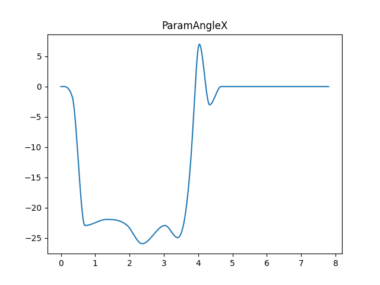

# live2d-motion3

使用纯 Python 读取 `motion3.json` 文件，并使用 `live2d-py` 的 `SetParameterValue` 控制模型动画

`motion3.json` 本质是一系列控制曲线，曲线由多段差值函数组成。

被控制的对象有：模型透明度、Part透明度、Parameter 的值等。

本仓库以 Parameter 为例，其他对象类似。

[motion_interploate.py](./motion_interpolate.py)：实现插值函数，并进行动画播放。

按空格键播放动画：

[motion_visualize.py](./motion_visualize.py)：将 `motion3.json` 中各个 Parameter 的曲线可视化

使用 matplotlib 绘制曲线：

无需建模工程文件即可生成 `motion3.json` 的动作编辑器：

